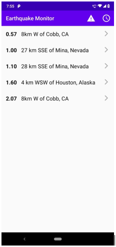
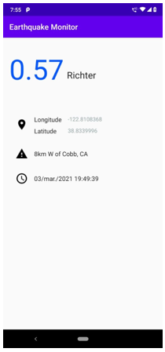

# Earthquake Monitor

Earthquake monitor o monitor de terremotos es una aplicación que te permite ver los terremotos ocurridos en el mundo en la última hora.

Haciendo uso de un **Recycler View**, mostrará todos los terremotos, el lugar donde ocurrieron y su magnitud.

Estos datos son obtenidos a través de la **API** del servicio geológico de Estados Unidos.

Adicionalmente implementé la librería **Room** para guardar los datos obtenidos de la API de forma local y consumirlos desde ahí, de esa forma los datos persisten aún si el dispositivo no cuenta con conexión a internet.

La aplicación también cuenta con el uso de **Shared Preferences** para guardar las preferencias del usuario en el orden de los terremotos, los cuales pueden ser mostrados en base a la fecha o a la magnitud.

Adicionalmente cuenta con la opción de seleccionar alguno de los terremotos, lo cual abrirá otra activity con más datos sobre el terremoto seleccionado.

